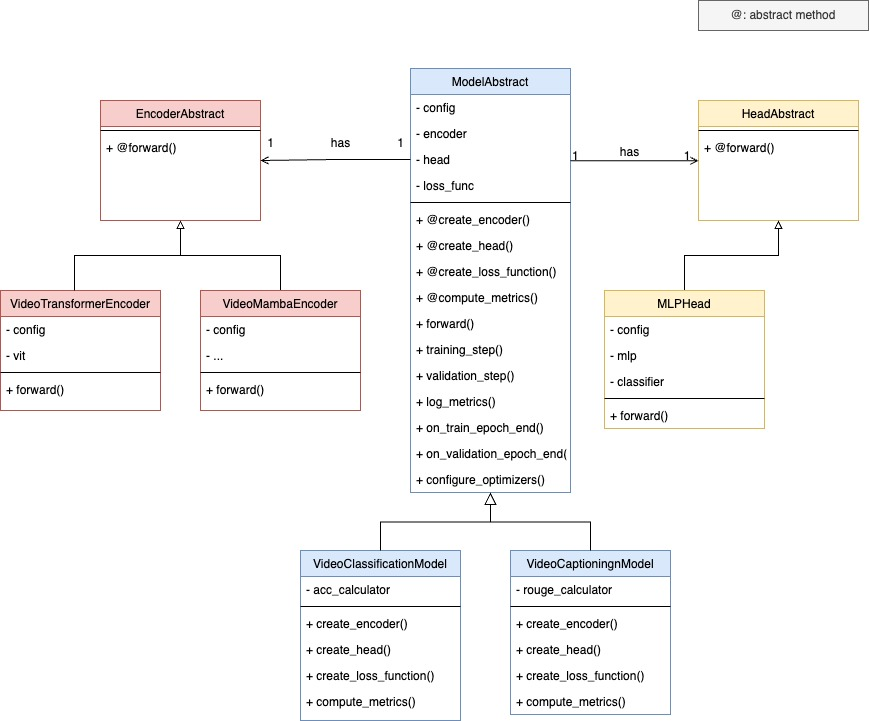

## Code structure
- Factory method. Each component (datasets, models, encoders, heads) has:
    - *_abstract.py: contains an abstract class which implements commonly used methods and define the interface for abstract methods for its subclasses 
    - _factory.py: logic to create the component based on its type
    - Subclasses that extends from the abstract class
- A model contains an encoder, a head for the specific downstream task, a particular loss function and metrics
- In this project, there are 2 types of model: Video Classification and Video Captioning.  

## Config
- Each experiment run has a particular config file which defines everything from dataset, model to training settings.
- Use fvcore lib to manage configs

## How to add a new model
- Think of all the components it has (encoder, decoder). For each component, extend from its abstract class and implement necessary methods. Then define the loss function and metric.
- Prepare the dataset, code a new dataset class by extending the abstract dataset class
- Define the config file
- The traning flow is implemented in the ModelAbstract class, so we don't have to rewritten everytime